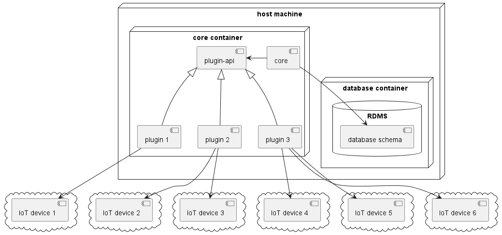

This application is used to collect data from a wide variety of internet of things devices.

Collected data is converted into a common, uniform format and persisted in the database.

Devices can be connected dynamically using plugins. Those plugins define how to fetch and convert data.

Below diagram presents the application's structure:

